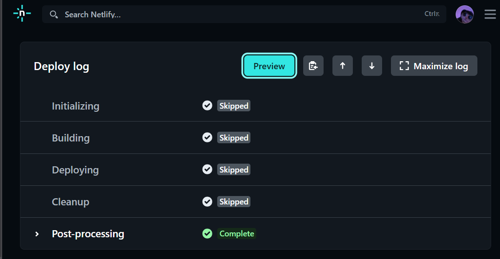
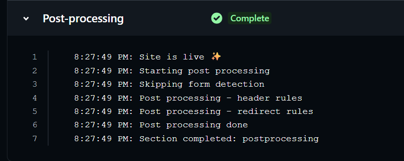
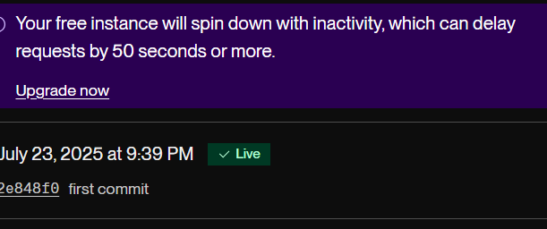
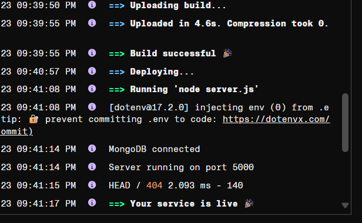

# 🗒️ QuickNote - MERN Note Taking App

A professional, full-stack note-taking app built with the MERN stack. Styled with TailwindCSS, animated with Framer Motion, and deployed via CI/CD pipelines.

---

## 🌐 Live Links

- **Frontend** (Netlify): [https://magenta-scone-b7c525.netlify.app/](https://magenta-scone-b7c525.netlify.app/)
- **Backend** (Render): [https://notes-app-plkn.onrender.com/api/notes](https://notes-app-plkn.onrender.com/api/notes)

---

## 🔧 Tech Stack

- **Frontend:** React, Tailwind CSS, HeroIcons, Framer Motion
- **Backend:** Express.js, MongoDB (Atlas), Mongoose
- **Deployment:** Netlify (frontend), Render (backend)
- **CI/CD:** GitHub Actions

---

## 🔄 CI/CD Pipelines

- GitHub Actions auto-run on every `main` push
- Frontend is built and deployed to Netlify
- Backend is redeployed via Render Deploy Hook

### 📸 CI/CD Pipeline Screenshots

**Frontend Deployment Success**




**Backend Deployment Success**




---

## 📈 Monitoring

- `/health` endpoint for uptime checks (e.g., used with UptimeRobot)
- Logs monitored via Render dashboard
- Optional: Sentry or LogRocket integration for error tracking

---

## 🛠 Maintenance Plan

- Weekly check for dependency updates
- Regular database backups (MongoDB Atlas automated backups)
- Documented rollback strategy: Revert to previous commit and re-trigger deploy

---

## 📂 Project Structure

```bash
quicknote/
├── frontend/ (React app)
├── backend/ (Express API)
└── .github/workflows/ (CI/CD YAML files)
```

---

## 🧪 How to Run Locally

```bash
# Backend
cd backend
npm install
npm run dev

# Frontend
cd ../frontend
npm install
npm start
```
### 🧠 Author
- Bethwel Kiplagat
- Student at PLP Academy.
- GitHub: @bethwel3001